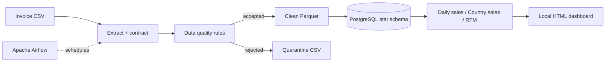

# Local E-commerce Invoice ETL

[Bản tiếng Việt](README.vi.md)

A complete, cloud-free implementation of an e-commerce invoice pipeline:

`Kaggle-compatible CSV → validation → cleaning and quarantine → Parquet → PostgreSQL star schema → analytics dashboard`

The project keeps the useful data-engineering parts of a larger cloud project while removing paid GCP/AWS dependencies.

## Architecture



## Implemented features

- Compatible with the Kaggle `E-Commerce Data` column structure.
- Reproducible local demo dataset; no Kaggle credential is required for verification.
- Guest-customer handling, cancellation detection and revenue calculation.
- Quarantine with explicit rejection reasons.
- Clean Parquet output for downstream analytics.
- Customer and product dimensions plus an invoice-line fact table.
- Idempotent upserts for repeatable pipeline runs.
- Daily sales, country sales and customer RFM marts.
- Airflow scheduling, retry policy and final run assertion.
- PostgreSQL and pgAdmin in Docker Compose.
- Dashboard generated from actual warehouse queries.

## Quick start

```bash
docker compose build
docker compose up -d warehouse
docker compose run --rm airflow python /opt/project/src/generate_data.py
docker compose run --rm airflow python /opt/project/src/pipeline.py
```

Start Airflow and pgAdmin:

```bash
docker compose up -d
```

- Airflow: <http://localhost:8083>
- pgAdmin: <http://localhost:5053>
- PostgreSQL: `localhost:5543`, database/user/password: `ecommerce`

## Demo

The following images are captured from an actual local pipeline run.

The verified run processed 1,200 invoice lines, accepted 1,196, quarantined 4 and preserved 12 cancellation lines. Airflow completed all three tasks successfully.


## Outputs

| Output | Description |
|---|---|
| `data/clean/invoice_lines.parquet` | Valid invoice lines |
| `data/rejected/invoice_lines.csv` | Quarantined lines |
| `artifacts/run_summary.json` | Run-level evidence |
| `artifacts/dashboard.html` | Warehouse-backed dashboard |
| `ecommerce.fact_invoice_line` | Analytical fact table |
| `ecommerce.mart_customer_rfm` | Customer RFM features |

## Tests

```bash
python -m pytest -q
```

## Real dataset

The expected schema matches [Kaggle E-Commerce Data](https://www.kaggle.com/datasets/carrie1/ecommerce-data). Download its CSV and pass it with:

```bash
python src/pipeline.py --input /path/to/data.csv
```
