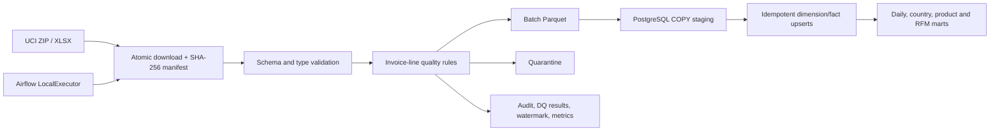
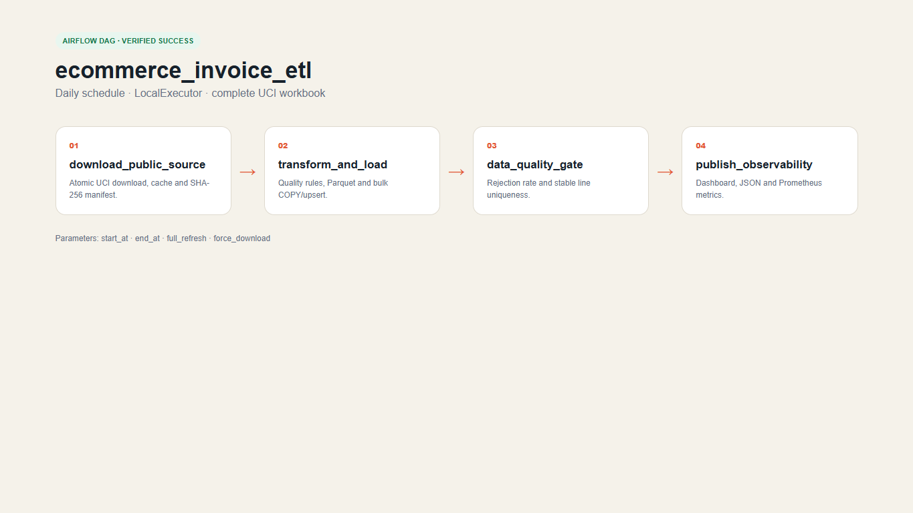
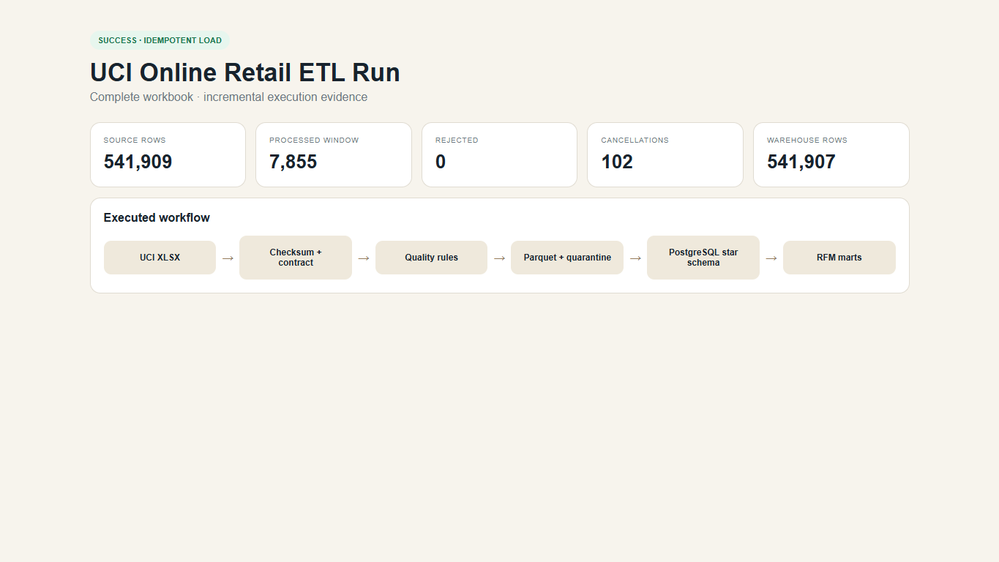
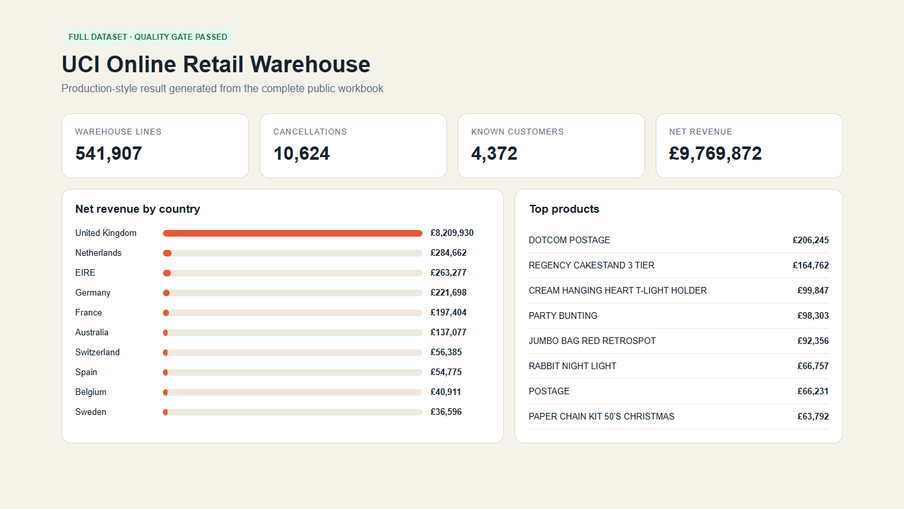

# UCI Online Retail ETL

[](https://github.com/npgb2505/ecommerce-invoice-etl-local/actions/workflows/ci.yml)

A full local data platform for the complete **UCI Online Retail** workbook. It downloads and fingerprints the source, applies invoice-line quality rules, preserves cancellations, produces batch-partitioned Parquet and quarantine outputs, and bulk-loads an idempotent PostgreSQL warehouse. Airflow supports scheduled incremental runs and timestamp backfills.

> Runs with Docker and public data only; no paid cloud account is required.

## Verified full-data run

| Metric | Result |
|---|---:|
| Source rows | 541,909 |
| Accepted / rejected | 541,907 / 2 |
| Cancellations preserved | 10,624 |
| Known customers | 4,372 |
| Coverage | 2010-12-01 to 2011-12-09 |
| Net revenue | £9,769,872.05 |
| Incremental lookback | 7,855 rows |
| Warehouse rows after rerun | 541,907 |

The rerun reprocessed a two-day lookback while keeping the fact table at exactly 541,907 rows.

## Architecture



Editable source: [docs/architecture.excalidraw](docs/architecture.excalidraw)

## Production-style behavior

- Complete 23 MB UCI workbook, not generated sample data.
- Atomic download, source checksum, reproducibility manifest, and cached reruns.
- Full refresh, timestamp watermark, late-arrival lookback, and bounded backfills.
- PostgreSQL `COPY` staging for more than half a million rows.
- Stable line identity and conflict-safe upserts.
- Cancellations remain in the fact table so net revenue is analytically correct.
- Quality results, pipeline history, Prometheus metrics, and per-batch evidence.
- Separate Airflow metadata database, scheduler, and webserver.

## Warehouse model

- `ecommerce.dim_customer`
- `ecommerce.dim_product`
- `ecommerce.fact_invoice_line`
- `ecommerce.mart_daily_sales`
- `ecommerce.mart_country_sales`
- `ecommerce.mart_product_performance`
- `ecommerce.mart_customer_rfm`
- control tables for runs, watermarks, and quality results

## Run locally

```bash
make full
docker compose up -d airflow airflow-scheduler pgadmin
```

- Airflow: <http://localhost:8083> — `airflow` / `airflow`
- PostgreSQL: `localhost:5543` — database/user/password: `ecommerce`
- pgAdmin: <http://localhost:5053> — `admin@example.com` / `admin`

Incremental run:

```bash
make incremental
```

Backfill:

```bash
make backfill START=2011-10-01T00:00:00+00:00 END=2011-10-31T23:59:59+00:00
```

Validation:

```bash
make test
docker compose run --rm airflow airflow dags test ecommerce_invoice_etl 2026-07-24
```

## Execution evidence







## Data source

[UCI Machine Learning Repository — Online Retail](https://archive.ics.uci.edu/dataset/352/online+retail). The workbook is downloaded at runtime and not committed.

Vietnamese documentation: [README.vi.md](README.vi.md)
