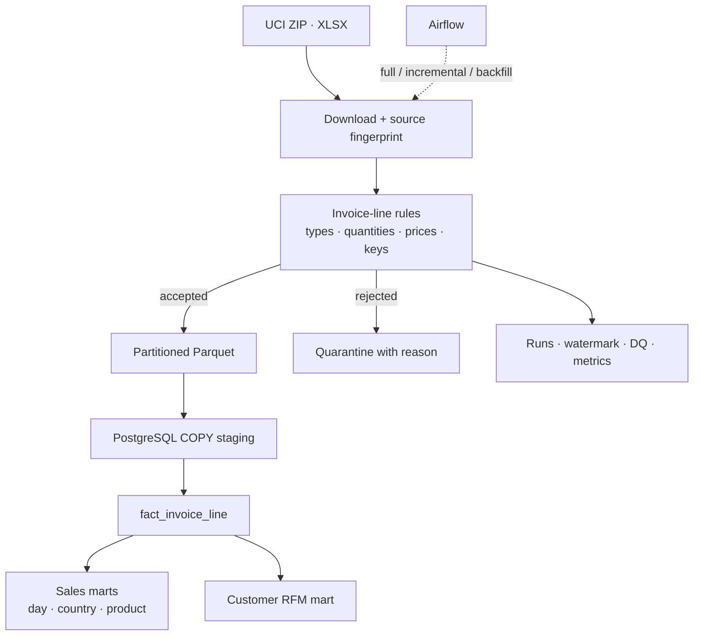

<p align="center">
  
</p>

<p align="center">
  <a href="https://github.com/npgb2505/ecommerce-invoice-etl-local/actions/workflows/ci.yml"></a>
  · <a href="README.vi.md">Tiếng Việt</a>
  · <a href="docs/architecture.excalidraw">Editable architecture</a>
</p>

# UCI Online Retail — Invoice Intelligence Pipeline

An invoice is not automatically a sale. This pipeline keeps cancellations, anonymous buyers and imperfect product descriptions visible so that revenue and customer metrics reflect the real business. It processes the complete **UCI Online Retail** workbook and publishes analytics-ready marts in PostgreSQL.

## The business questions

| Question | Data product |
|---|---|
| What is actual net revenue after cancellations? | `mart_daily_sales` |
| Which markets generate the most value? | `mart_country_sales` |
| Which products combine demand and revenue? | `mart_product_performance` |
| Who are the recent, frequent and high-value customers? | `mart_customer_rfm` |

## Dataset realities handled explicitly

```text
541,909 invoice lines
├── 541,907 accepted
├──       2 quarantined
├──  10,624 cancellation lines retained
└──   4,372 identified customers
```

- **Cancellation invoices stay in the fact table.** Removing them would inflate revenue.
- **Missing customer IDs remain analytically usable.** They are excluded only from customer-level RFM.
- **Stable line IDs make reruns safe.** A two-day lookback reprocessed 7,855 rows while the warehouse remained at 541,907.
- **PostgreSQL `COPY` handles volume.** More than half a million lines are staged in bulk, not inserted one by one.

## From workbook to customer insight



## Full-workbook scorecard

| Coverage | Net revenue | Incremental window | Warehouse after rerun |
|:---:|:---:|:---:|:---:|
| 2010-12-01 → 2011-12-09 | **£9,769,872.05** | 7,855 lines | **541,907** lines |

## Run the analysis locally

```bash
make full
docker compose up -d airflow airflow-scheduler pgadmin
```

Then choose a workload:

```bash
make incremental
make backfill START=2011-10-01T00:00:00+00:00 END=2011-10-31T23:59:59+00:00
make test
```

- Airflow: <http://localhost:8083> — `airflow / airflow`
- PostgreSQL: `localhost:5543` — database/user/password: `ecommerce`
- pgAdmin: <http://localhost:5053> — `admin@example.com / admin`

## See the pipeline run

The first two images are direct captures from the running Airflow UI.

| Airflow orchestration | Business-facing output |
|---|---|
| Three successful runs and four green tasks | Revenue, cancellations and customer metrics |
|  |  |

### The numbers behind the green run

The real `transform_and_load` log records 541,909 source rows, 541,907 warehouse rows and return code `0`.


<details>
<summary><strong>Open the machine-readable run summary</strong></summary>


</details>

## Data source

[UCI Machine Learning Repository — Online Retail](https://archive.ics.uci.edu/dataset/352/online+retail). The original workbook is downloaded at runtime and is not committed.
