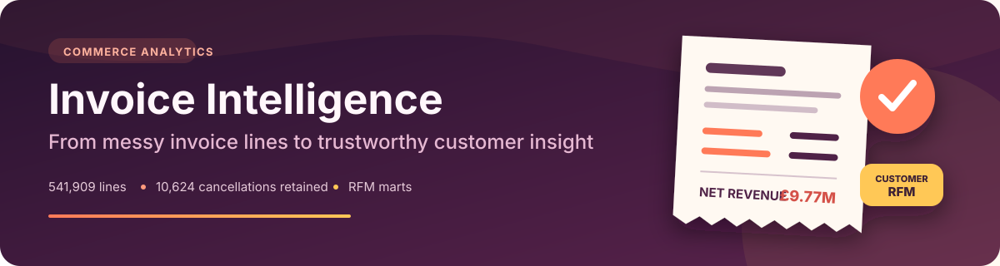
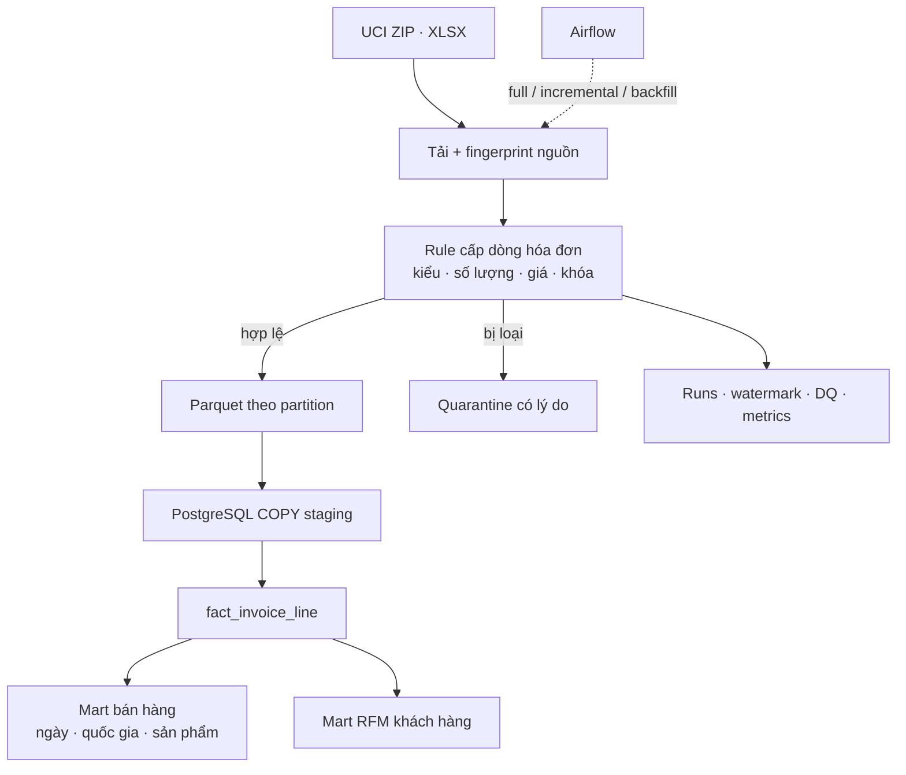
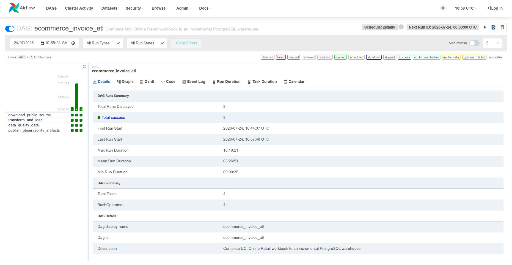
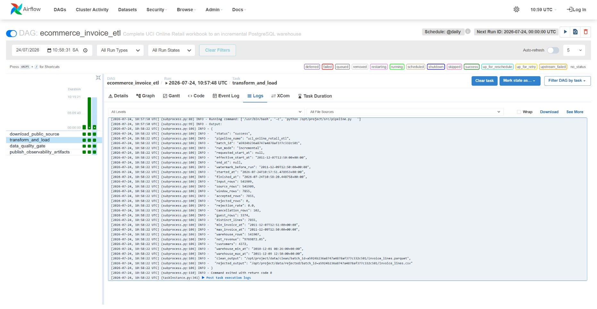

<p align="center">
  
</p>

<p align="center">
  <a href="https://github.com/npgb2505/ecommerce-invoice-etl-local/actions/workflows/ci.yml"></a>
  · <a href="README.md">English</a>
  · <a href="docs/architecture.excalidraw">Sơ đồ chỉnh sửa được</a>
</p>

# UCI Online Retail — Pipeline phân tích hóa đơn

Một hóa đơn chưa chắc đã là doanh thu. Pipeline này giữ lại giao dịch hủy, người mua ẩn danh và mô tả sản phẩm chưa hoàn hảo để số liệu doanh thu và khách hàng phản ánh đúng nghiệp vụ. Toàn bộ workbook **UCI Online Retail** được xử lý và xuất thành các mart sẵn sàng phân tích trong PostgreSQL.

## Bài toán kinh doanh được trả lời

| Câu hỏi | Data product |
|---|---|
| Doanh thu thuần sau giao dịch hủy là bao nhiêu? | `mart_daily_sales` |
| Thị trường nào tạo ra nhiều giá trị nhất? | `mart_country_sales` |
| Sản phẩm nào vừa có nhu cầu vừa tạo doanh thu? | `mart_product_performance` |
| Khách hàng nào mua gần đây, thường xuyên và giá trị cao? | `mart_customer_rfm` |

## Những vấn đề thật trong dữ liệu

```text
541.909 dòng hóa đơn
├── 541.907 dòng hợp lệ
├──       2 dòng quarantine
├──  10.624 dòng hủy được giữ lại
└──   4.372 khách hàng xác định được
```

- **Giao dịch hủy vẫn nằm trong fact.** Xóa chúng sẽ làm doanh thu bị phóng đại.
- **Thiếu CustomerID không làm mất giá trị giao dịch.** Chỉ loại khỏi phép tính RFM cấp khách hàng.
- **Khóa dòng ổn định giúp chạy lại an toàn.** Lookback hai ngày xử lý lại 7.855 dòng nhưng warehouse vẫn giữ 541.907 dòng.
- **PostgreSQL `COPY` xử lý khối lượng lớn.** Hơn nửa triệu dòng được nạp theo lô, không insert từng dòng.

## Từ workbook đến insight khách hàng



## Scorecard toàn bộ workbook

| Khoảng thời gian | Doanh thu thuần | Cửa sổ incremental | Warehouse sau chạy lại |
|:---:|:---:|:---:|:---:|
| 01/12/2010 → 09/12/2011 | **£9.769.872,05** | 7.855 dòng | **541.907** dòng |

## Chạy phân tích trên máy

```bash
make full
docker compose up -d airflow airflow-scheduler pgadmin
```

Chọn chế độ chạy tiếp theo:

```bash
make incremental
make backfill START=2011-10-01T00:00:00+00:00 END=2011-10-31T23:59:59+00:00
make test
```

- Airflow: <http://localhost:8083> — `airflow / airflow`
- PostgreSQL: `localhost:5543` — database/user/password: `ecommerce`
- pgAdmin: <http://localhost:5053> — `admin@example.com / admin`

## Nhìn trực tiếp pipeline hoạt động

Hai ảnh Airflow dưới đây được chụp trực tiếp từ hệ thống đang chạy.

| Điều phối kỹ thuật | Kết quả hướng nghiệp vụ |
|---|---|
| Ba run thành công, bốn task đều xanh | Doanh thu, cancellation và chỉ số khách hàng |
|  |  |

### Những con số phía sau run màu xanh

Log thật của `transform_and_load` ghi nhận 541.909 dòng nguồn, 541.907 dòng warehouse và mã trả về `0`.



<details>
<summary><strong>Mở bản tóm tắt lần chạy dành cho máy đọc</strong></summary>


</details>

## Nguồn dữ liệu

[UCI Machine Learning Repository — Online Retail](https://archive.ics.uci.edu/dataset/352/online+retail). Workbook gốc được tải lúc chạy và không được commit.
