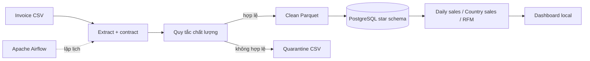

# ETL hóa đơn thương mại điện tử chạy local

[English README](README.md)

Pipeline đầy đủ, không sử dụng dịch vụ cloud trả phí:

`CSV theo schema Kaggle → kiểm tra dữ liệu → làm sạch/cách ly → Parquet → PostgreSQL star schema → dashboard`

## Kiến trúc



## Đã triển khai

- Tương thích cấu trúc cột của bộ Kaggle E-Commerce Data.
- Dữ liệu demo tái lập được, không cần Kaggle credential.
- Xử lý khách vãng lai, phát hiện giao dịch hoàn tiền và tính doanh thu thuần.
- Cách ly bản ghi lỗi kèm lý do.
- Xuất Parquet sạch cho các nhu cầu phân tích tiếp theo.
- Dimension khách hàng/sản phẩm và fact chi tiết hóa đơn.
- Upsert idempotent để chạy lại an toàn.
- Mart doanh số ngày, quốc gia và đặc trưng RFM.
- Airflow scheduling, retry và bước kiểm tra kết quả cuối.
- Dashboard được sinh từ truy vấn warehouse thật.

## Chạy nhanh

```bash
docker compose build
docker compose up -d warehouse
docker compose run --rm airflow python /opt/project/src/generate_data.py
docker compose run --rm airflow python /opt/project/src/pipeline.py
docker compose up -d
```

- Airflow: <http://localhost:8083>
- pgAdmin: <http://localhost:5053>
- PostgreSQL: `localhost:5543`, database/user/password: `ecommerce`

## Demo đã kiểm chứng

Lần chạy thực tế xử lý 1.200 dòng hóa đơn, chấp nhận 1.196 dòng, cách ly 4 dòng và giữ đúng 12 dòng hoàn tiền. Ba tác vụ Airflow đều hoàn tất thành công.


## Dữ liệu thật

Schema đầu vào khớp với [Kaggle E-Commerce Data](https://www.kaggle.com/datasets/carrie1/ecommerce-data):

```bash
python src/pipeline.py --input /path/to/data.csv
```

## Kiểm thử

```bash
python -m pytest -q
```

