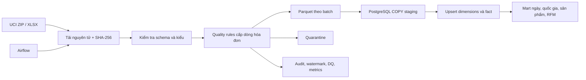

# Pipeline UCI Online Retail

Dự án xử lý toàn bộ workbook **UCI Online Retail**, không sử dụng dữ liệu tự sinh. Pipeline tải và kiểm chứng nguồn, làm sạch ở cấp dòng hóa đơn, giữ nguyên giao dịch hủy, xuất Parquet/quarantine theo batch rồi nạp hàng loạt vào PostgreSQL. Airflow điều phối full refresh, incremental và backfill.

> Chạy hoàn toàn bằng Docker và dữ liệu công khai, không cần cloud trả phí.

## Kết quả đã kiểm chứng

| Chỉ số | Kết quả |
|---|---:|
| Dòng nguồn | 541.909 |
| Hợp lệ / bị loại | 541.907 / 2 |
| Dòng hủy được giữ lại | 10.624 |
| Khách hàng xác định được | 4.372 |
| Khoảng thời gian | 01/12/2010–09/12/2011 |
| Doanh thu thuần | £9.769.872,05 |
| Dòng ở lần incremental | 7.855 |
| Dòng warehouse sau chạy lại | 541.907 |

Lần incremental xử lý lại cửa sổ hai ngày nhưng không làm tăng số dòng fact, chứng minh pipeline idempotent.

## Kiến trúc



Bản Excalidraw có thể chỉnh sửa: [docs/architecture.excalidraw](docs/architecture.excalidraw)

## Điểm kỹ thuật chính

- Tải toàn bộ workbook 23 MB của UCI, có checksum và manifest truy vết.
- Full refresh, watermark theo thời gian, lookback cho dữ liệu đến trễ và backfill có giới hạn.
- Dùng PostgreSQL `COPY` thay cho insert từng dòng.
- Khóa dòng ổn định và upsert an toàn khi chạy lại.
- Giữ giao dịch hủy để doanh thu thuần và RFM phản ánh đúng nghiệp vụ.
- Lưu lịch sử batch, từng quality check, JSON evidence và Prometheus metrics.
- Airflow tách metadata PostgreSQL, scheduler và webserver.

## Mô hình dữ liệu

`dim_customer`, `dim_product`, `fact_invoice_line`, `mart_daily_sales`, `mart_country_sales`, `mart_product_performance`, `mart_customer_rfm` cùng các bảng điều khiển run/watermark/DQ.

## Cách chạy

```bash
make full
docker compose up -d airflow airflow-scheduler pgadmin
```

- Airflow: <http://localhost:8083> — `airflow` / `airflow`
- PostgreSQL: `localhost:5543` — database/user/password: `ecommerce`
- pgAdmin: <http://localhost:5053> — `admin@example.com` / `admin`

```bash
make incremental
make backfill START=2011-10-01T00:00:00+00:00 END=2011-10-31T23:59:59+00:00
```

Nguồn: [UCI Online Retail](https://archive.ics.uci.edu/dataset/352/online+retail). Tệp gốc được tải lúc chạy và không commit lên Git.
